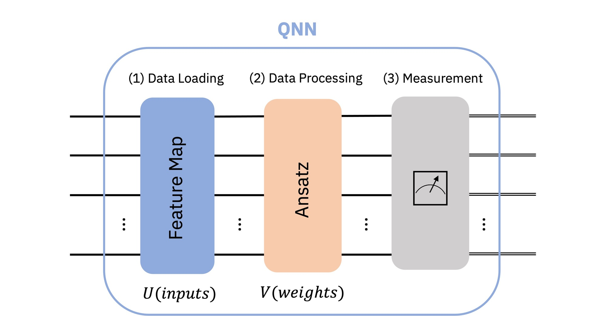

# Quantum Neural Networks (QNN)

This directory contains implementations of **Quantum Neural Networks (QNNs)** using Qiskit and PyTorch. A QNN is a computational model where classical data is encoded into quantum states and processed through parameterized quantum circuits to perform tasks like classification and regression.

## 1. Overview

<p align="center">
  
</p>
As illustrated in the architecture diagram above, a standard QNN pipeline consists of three primary stages:

1.  **Data Loading (Feature Map):** Classical data $x$ (e.g., compressed image features) is encoded into a quantum state via a unitary operator $U(x)$.
2.  **Data Processing (Ansatz):** A parameterized circuit $V(\theta)$, also known as an Ansatz, processes the quantum state. The parameters $\theta$ are the trainable weights of the network.
3.  **Measurement:** The quantum state is measured to extract classical information (expectation values), which serves as the output for the next layer or the final prediction.

## 2. Qiskit Implementation

Based on the [Qiskit Machine Learning](https://qiskit-community.github.io/qiskit-machine-learning/tutorials/01_neural_networks.html) framework, we implement two primary types of neural networks:

- **EstimatorQNN:** Used to compute the expectation value of quantum observables. It is highly effective for hybrid architectures where a continuous output is required for further classical processing.
- **SamplerQNN:** Designed to work with the bitstring distributions resulting from measurements, ideal for tasks requiring categorical probability distributions.

## 3. Hybrid Integration (3-Class Classification)

In this project, we leverage the **TorchConnector** to integrate Qiskit circuits into a PyTorch workflow. This allows us to build **Hybrid Quantum-Classical Neural Networks (HQCNN)**.

- **Feature Compression:** A classical CNN reduces 28x28 MNIST images into a 2-dimensional vector.
- **Quantum Layer:** The 2D vector is processed by a 2-qubit QNN.
- **Multi-Class Output:** For this implementation, the QNN output is mapped to a classical linear layer to classify **three digits (0, 1, and 2)**.
- **Seamless Backpropagation:** Both classical and quantum weights are updated simultaneously using the Adam optimizer.

## 4. Getting Started

### Installation

To run the notebooks in this directory, ensure you have the `qiskit-machine-learning` package installed with the optional `torch` dependencies:

```bash
pip install qiskit-machine-learning
pip install 'qiskit-machine-learning[torch]'
```
